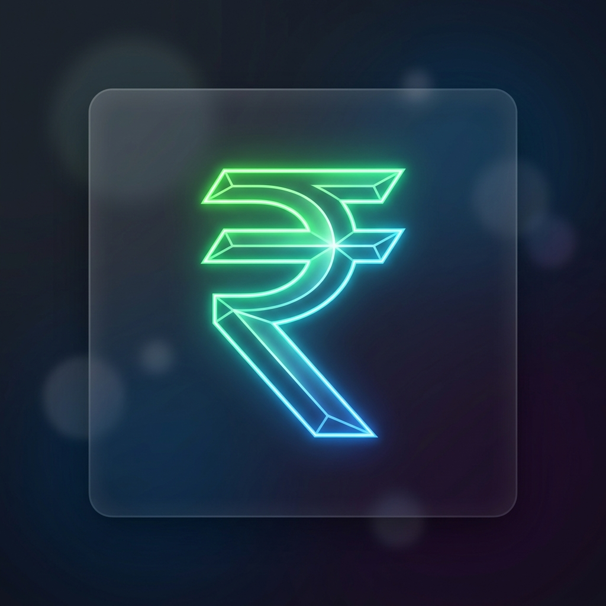

# Expense Tracker

A modern, minimalist personal finance tracker built with React Native (Expo) and Swift App Intents. 



## Features

- **Apple Shortcuts Integration**: Automatically import expenses by passing receipts or screenshots directly from the iOS Shortcuts app. Uses native on-device ML Kit OCR to parse the transaction amount!
- **Dark Mode Ready**: Beautifully crafted interface that responds instantly to your system's light/dark mode preference, utilizing a centralized Theme configuration.
- **Smart Categorization**: Tag expenses with custom categories, icons, and colors.
- **Dynamic Summaries**: View your spending habits through engaging Pie Charts and Stacked Bar Charts that visualize your past 6 months of data.
- **Daily Reminders**: Local push notifications remind you to log your daily expenses at 8:30 PM.
- **Edit History**: Made a mistake? Easily tap any past expense in your history to edit the amount, description, or date.

## Architecture

This project is an Expo managed project with a custom native plugin architecture.
- **Frontend**: React Native, React Navigation, React Native Chart Kit
- **Native iOS**: Swift App Intents (`ios-src/AddExpenseIntent.swift`) connected via a custom Expo Config Plugin (`plugins/withAppIntents.js`).
- **Storage**: AsyncStorage for lightweight, secure, on-device data persistence.

## Getting Started

1. Install dependencies:
   ```bash
   npm install
   ```

2. Because this app relies on native iOS App Intents and Push Notifications, it requires a custom development client or a full build. **You cannot run this fully in Expo Go.**
   
   Build for iOS:
   ```bash
   eas build --platform ios
   ```

3. Start the bundler:
   ```bash
   npx expo start
   ```

## Creating the Shortcut
1. Open the iOS Shortcuts app.
2. Create a new shortcut.
3. Add the "Take Screenshot" action.
4. Search for "Expense Tracker" and add the "Process Receipt" action below it.
5. Tap and hold the "Receipt Image" parameter, select "Select Magic Variable", and tap the screenshot output.
6. (Optional) Map the shortcut to the Action Button or Back Tap in iOS Settings!
